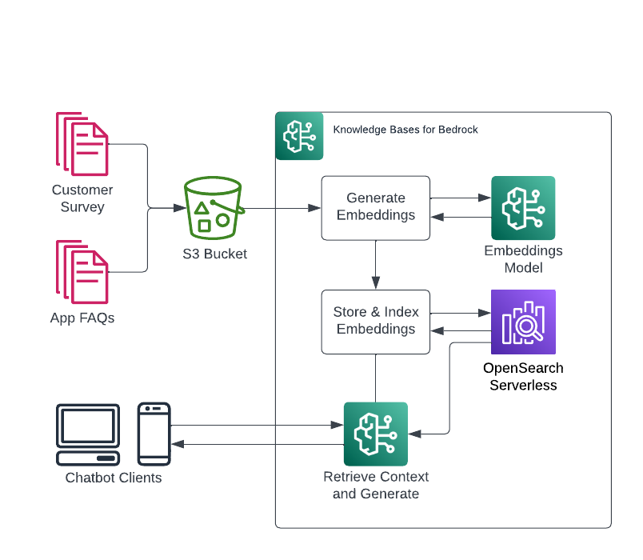

# LLM Chatbot

## Project Overview

This project showcases an advanced LLM-powered chatbot that can intelligently process and answer questions about PDF documents. By leveraging state-of-the-art language models and vector embeddings, the chatbot provides an intuitive interface for users to interact with complex document content.

## Alternative Services

The following are some alternative services that can be used for each component:

- **Storage:**
  - Amazon S3
  - Google Cloud Storage
  - Azure Blob Storage
  - MinIO (self-hosted)

- **Embedding:**
  - OpenAI Embeddings
  - Hugging Face Sentence Transformers
  - TensorFlow Embeddings
  - FastText

- **Language Models:**
  - OpenAI GPT models
  - Hugging Face Transformers
  - Google PaLM
  - Meta LLaMA

- **Vector Databases:**
  - FAISS
  - Pinecone
  - Weaviate
  - Qdrant

**Note:** When substituting services, ensure to update the relevant client libraries, configurations, and environment variables in the code. Because, this example provides just the example using AWS Berock-Runtime as a service.

## Architecture


## Services Used

### Storage Service (e.g., Amazon S3)

**Purpose:** Used for storing the vector index files (e.g., `my_faiss.faiss` and `my_faiss.pkl`) which are necessary for retrieving embedded document vectors.

**Current Implementation:** `s3_client` from the boto3 library for Amazon S3.

**Alternatives:** 
- Google Cloud Storage (`google-cloud-storage` library)
- Azure Blob Storage (`azure-storage-blob` library)
- MinIO (`minio` library) for self-hosted option

**Note:** The storage service can be easily swapped by modifying the relevant client in the code. Ensure to update the configuration and environment variables accordingly.

## Project Components

### File Upload and Processing (`admin.py`)

- Users can upload a PDF file.
- The PDF file is split into chunks for better processing.
- The chunks are embedded using Amazon Bedrock and stored in a FAISS index.
- The FAISS index is saved locally and uploaded to Amazon S3 for persistence.

### Chat Interface (`user.py`)

- Loads the FAISS index from Amazon S3.
- Allows users to ask questions about the content of the uploaded PDF.
- Retrieves relevant document chunks using FAISS and generates answers using Amazon Bedrock.

## Prerequisites

To set up and run the LLM Chatbot project, ensure you have the following prerequisites:

1. **Docker:**
   - Docker must be installed on your system. You can download and install Docker from [here](https://www.docker.com/products/docker-desktop).

2. **AWS Credentials:**
   - Configure your AWS credentials. Ensure you have the `~/.aws/credentials` file set up with the necessary permissions to access Amazon S3 and Amazon Bedrock services. The credentials file should look like this:
     ```
     [default]
     aws_access_key_id = YOUR_ACCESS_KEY
     aws_secret_access_key = YOUR_SECRET_KEY
     ```

3. **Python (optional but recommended for local testing):**
   - Python 3.8 or later installed. You can download Python from [here](https://www.python.org/downloads/).

4. **Amazon S3 Bucket:**
   - Create an Amazon S3 bucket where the FAISS index files will be stored. Note down the bucket name as it will be used in the Docker run command for the user panel.

5. **Amazon Bedrock:**
   - Ensure you have access to Amazon Bedrock services, including the embeddings model (`<amazon.titan-embed-text-v1>`) and the LLM model of your choice by (`<modeID>`).

6. **Network and Firewall:**
   - Ensure that your network and firewall settings allow Docker to bind to the necessary ports (`5001` for admin and `5002` for the user panel).

7. **Storage Space:**
   - Ensure you have sufficient storage space for uploading and processing PDF files, and for storing the generated FAISS index files locally before they are uploaded to S3.

By meeting these prerequisites, you'll be prepared to build and deploy the LLM Chatbot project seamlessly.


### Admin Steps

1. **Build the Docker Image:**
    ```sh
    docker build -t pdf-reader-chatbot .
    ```

2. **Run the Admin Panel:**
    ```sh
    docker run -p 5001:5001 -it pdf-reader-chatbot
    ```

3. **Upload the PDF:**
    - Access the admin panel at `http://localhost:5001`.
    - Upload the PDF file you want to train the model on.
    - Wait for the index files to be created and uploaded to Amazon S3.

### User Steps

1. **Build the Docker Image:**
    ```sh
    docker build -t pdf-reader-chatbot-client .
    ```

2. **Run the User Panel:**
    ```sh
    docker run -e BUCKET_NAME=<NAME_OF_BUCKET> -v ~/.aws:/root/.aws -p 5002:5002 -it pdf-reader-chatbot-client
    ```

3. **Ask Questions:**
    - Access the user panel at `http://localhost:5002`.
    - Enter the question you want to ask about the PDF content.
    - The system will find the relevant answer from the index files using similarity metrics of RetrievalQA langchain.
    - The retrieved part will be sent to the Bedrock runtime to create the answer properly, which will then be displayed.

